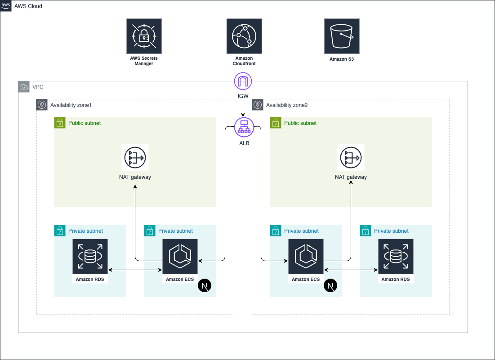

# nextjs-ssr

## 概要
nextjs(SSR)をAWSにデプロイするterraformのコード
画像などはS3に配置しcloudFront経由で取得を行う想定
cloudfrontでSSRで生成したHTMLをキャッシュする

- app
   - nextjsのコードを配置
- infra
   - terraformのコードを配置

## デプロイ手順

AWSのアクセスキーを貼り付け

```
cd nextjs-ssr/modules/network
terraform init
terraform plan -var-file=../../env/terraform.tfvars
terraform apply -var-file=../../env/terraform.tfvars
```

## 削除方法

```
terraform destroy -var-file=../../env/terraform.tfvars
```

## 構成図

